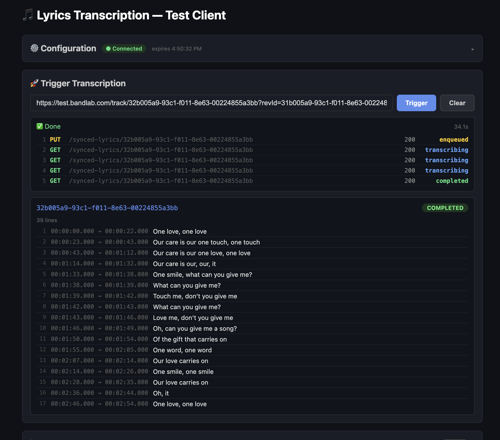

# Lyrics Transcription — UI Test Client

Local Vue.js app for **manual testing** of the Synced Lyrics API after deployment.

Not intended for production use — this is a developer tool for verifying
API behaviour, inspecting transcription results, and triggering regeneration
during development and QA cycles.



## What it does

- **Trigger transcription** — paste a BandLab track URL (or bare post ID),
  the app extracts the post ID, calls `PUT /synced-lyrics/{postId}`, and
  polls `GET /synced-lyrics/{postId}` until the result is ready.
- **View all lyrics** — calls `GET /synced-lyrics` and lists every
  transcription job with status, lyrics preview, and error details.
- **Regenerate** — re-triggers transcription for a completed/failed post
  via `PUT /synced-lyrics/{postId}` with `{ "regenerate": true }`.

## Setup

```bash
cd services/lyrics-aws/ui-client
npm install
npm run dev
```

Open `http://localhost:5173` in a browser.

## Configuration

On first load, fill in two fields at the top of the page:

| Field          | Description                                  |
|----------------|----------------------------------------------|
| **API Base URL** | The API Gateway base URL for the target env (e.g. `https://<api-id>.execute-api.<region>.amazonaws.com`) |
| **Bearer Token** | A valid BandLab auth token for the target env |
